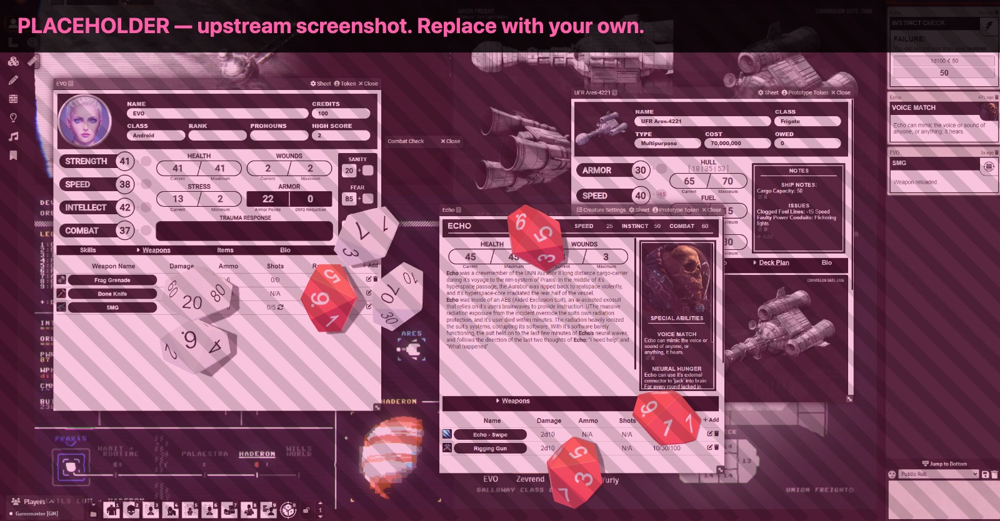

## MoSh | Unofficial Mothership RPG | 1e | FoundryVTT

An unofficial implementation of Tuesday Knight's Mothership role playing system. Mothership is the property of Tuesday Knight Games, and can be purchased at https://mothershiprpg.com/

This is the Rune Goblin **hard fork** of [`Futil/foundry-mothership`](https://github.com/Futil/foundry-mothership), originally by Futilrevenge and hollowphoton. It is not a tracking fork and upstream changes are not merged: the build was replaced (gulp → Vite), the data layer moved to v14 DataModels, the 0e rules branches and compendia were removed, and the sheets are being rewritten as ApplicationV2 + Svelte. Those changes are irreconcilable with upstream in both directions. Install from the manifest below, not from the original repository.

#### Features
- Full 1e system support with conditions, rolltables, and macros
- Character sheets styled to resemble the official printout sheets
- Comprehensive automation for all checks, saves, attacks, wounds, and conditions
- Intuitive hotbar macros for key tasks that guide you through step-by-step
- Customizable ship and creature sheets with selectable stats
- Macro support for weapons, items, stats, and skills
- Includes optional house rules, like Calm and Android panic tables
- Custom Dice So Nice! themes for regular rolls, damage, and panic checks

#### Installation
1. Load up Foundry VTT and go to the Game Systems tab
2. Click Install System
3. Paste this URL into the Manifest URL field: https://github.com/rune-goblin/mothership-rpg/releases/latest/download/system.json

#### Licensing & Community Guidelines
- This system is not affiliated with Tuesday Knight Games and is released for non-commercial purposes.
- Mothership is copyright Tuesday Knight Games. All relevant trademarks and IP are the property of their respective owners.
- This Foundry VTT system for Mothership is an unofficial community project, released under the MIT License. Third-party modules (free or paid) are welcome, but are not supported, and may break with future updates to the system.
